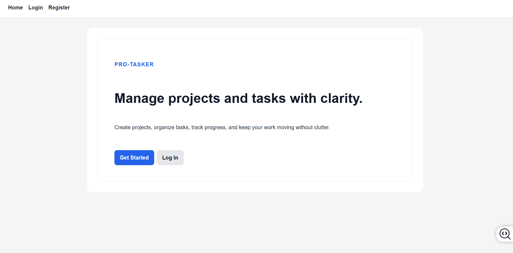
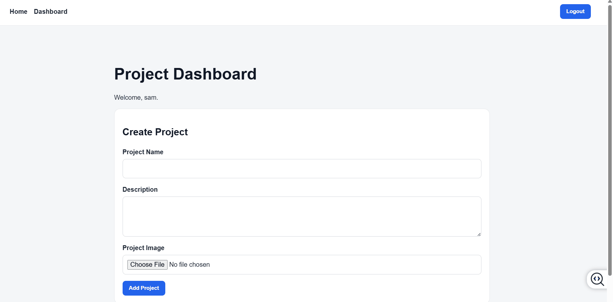
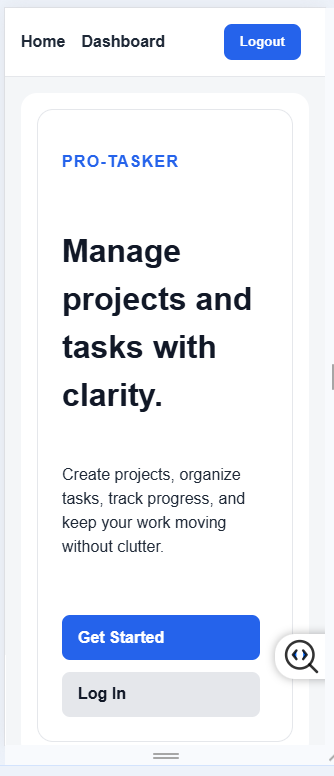
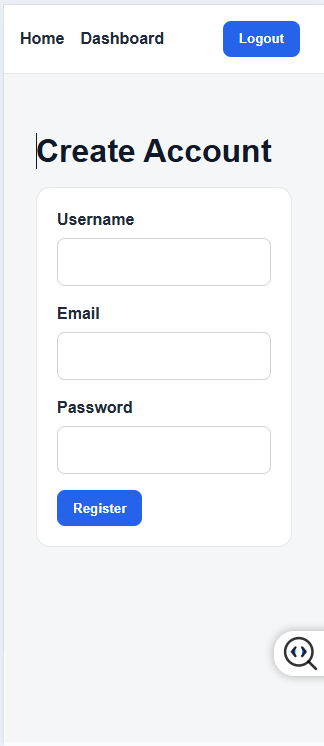
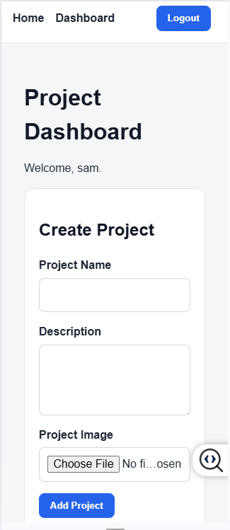
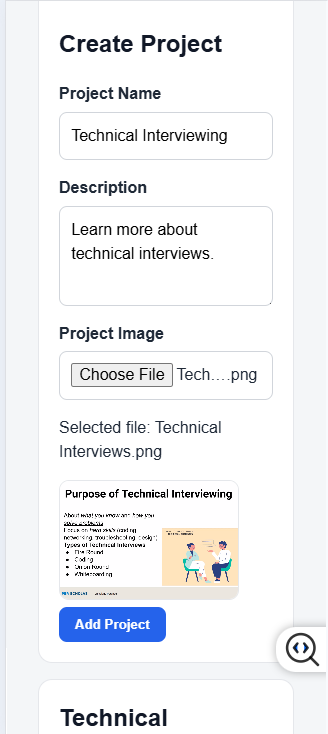
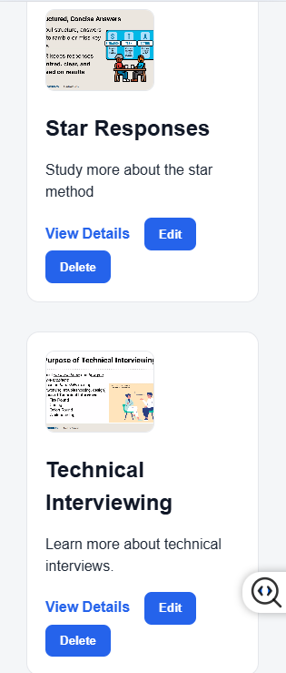
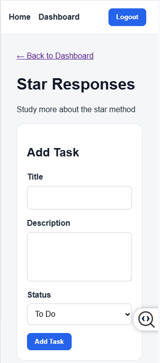

# Pro-Tasker Frontend


## Overview

Pro-Tasker Frontend is a React and TypeScript single-page application that provides a user-friendly interface for managing projects and tasks.

The application allows users to register, verify their email address, authenticate securely, create projects, organize tasks, track progress, and manage their work through a responsive user interface.

The frontend communicates with the Pro-Tasker Backend API using JWT authentication and RESTful API requests.

---

## Architecture

The frontend follows a component-based architecture built with React and TypeScript.

React Router manages application navigation while React Context manages global authentication state.

The application follows a separation-of-concerns approach where presentation, state management, API communication, and backend business logic are organized into distinct layers.

The application communicates with the backend through RESTful API endpoints secured with JWT authentication.

### Frontend Responsibilities

* User interface and user experience
* Authentication state management
* Form validation and user feedback
* Project and task management workflows
* Client-side image upload and preview

### Backend Responsibilities

* Authentication and authorization
* Email verification
* Database operations
* Business logic and API processing
* Data persistence

## Related Repositories

### Backend API
https://github.com/keokistevenson/pro-tasker-backend


---

## Feature Demonstrations

### User Registration & Email Verification



### Project Creation & Management



---

## Mobile Application Walkthrough

<table>
<tr>
<td align="center">
<b>Home Page</b><br>

</td>

<td align="center">
<b>User Registration</b><br>

</td>
</tr>

<tr>
<td align="center">
<b>Dashboard</b><br>

</td>

<td align="center">
<b>Project Image Upload</b><br>

</td>
</tr>

<tr>
<td align="center">
<b>Project Cards</b><br>

</td>

<td align="center">
<b>Task Creation</b><br>

</td>
</tr>
</table>

---

## Features

### Image Upload & Preview

- Upload project images from a local device
- Client-side image processing using the FileReader API
- Thumbnail previews displayed on project cards
- Image previews displayed on project details pages
- Images persist throughout the user session without backend storage

### Development Practices

- Strong typing with TypeScript
- Reusable React components
- Context-based state management
- Separation of concerns

### Authentication

- User registration
- User login
- Email verification using one-time verification codes
- Persistent authentication using JWT tokens
- Protected routes
- Secure logout functionality


### Project Management

- Create projects
- View all projects
- Edit project details
- Delete projects

### Task Management

- Create tasks
- View project tasks
- Edit task details
- Update task status
- Delete tasks

### Accessibility

- Semantic HTML
- Form labels and input associations
- ARIA attributes for interactive controls
- ARIA live regions and alert messaging for errors
- Screen reader-friendly navigation
- Improved keyboard accessibility

### User Experience

- Responsive layout
- Loading states
- Error handling
- Empty-state messaging

---

## Technologies Used

### Frontend

- React
- TypeScript
- React Router
- Vite
- Fetch API
- CSS

### Backend Integration

- REST API
- JSON Web Tokens (JWT)

---

## Application Pages

### Home Page

Provides an introduction to the application and entry points for registration and login.

### Authentication Pages

- Register
- Login

### Dashboard

- View all projects
- Create projects
- Edit projects
- Delete projects

### Project Details

- View project information
- Create tasks
- Edit tasks
- Update task status
- Delete tasks

---

## Installation

### Clone Repository

```bash
git clone <repository-url>
cd pro-tasker-frontend
```

### Install Dependencies

```bash
npm install
```

### Configure Environment Variables

Create a `.env` file:

```env
VITE_API_BASE_URL=http://localhost:3000/api
```

### Start Development Server

```bash
npm run dev
```

### Build for Production

```bash
npm run build
```

### Preview Production Build

```bash
npm run preview
```

---

## Environment Variables

| Variable | Description |
|-----------|-------------|
| VITE_API_BASE_URL | Backend API URL |

---

## Project Structure

```text
pro-tasker-frontend/
│
├── src/
│   ├── api/
│   │   └── api.ts
│   │
│   ├── assets/
│   │   ├── CreateProject.gif
│   │   ├── EmailVerification.gif
│   │   ├── Dashboard(1).png
│   │   ├── Home.png
│   │   ├── ProjectCards.png
│   │   ├── ProjectImageUpload.png
│   │   ├── Registration.png
│   │   └── Task.png
│   │
│   ├── components/
│   │   ├── ImageUpload.tsx
│   │   ├── Navbar.tsx
│   │   ├── ProjectCard.tsx
│   │   ├── ProjectForm.tsx
│   │   ├── ProtectedRoute.tsx
│   │   ├── TaskForm.tsx
│   │   ├── TaskItem.tsx
│   │   └── TaskList.tsx
│   │
│   ├── context/
│   │   └── AuthContext.tsx
│   │
│   ├── pages/
│   │   ├── Dashboard.tsx
│   │   ├── Home.tsx
│   │   ├── Login.tsx
│   │   ├── ProjectDetails.tsx
│   │   ├── Register.tsx
│   │   └── VerifyEmail.tsx
│   │
│   ├── App.css
│   ├── App.tsx
│   ├── index.css
│   └── main.tsx
```

---

## Folder Descriptions

| Folder | Purpose |
|-----------|-------------|
| api | API communication layer |
| assets | Images and static assets |
| components | Reusable UI components |
| context | Global authentication state |
| pages | Route-based page components |

---

## Authentication Flow

```text
User Registration
      │
      ▼
Verification Code Sent
      │
      ▼
Email Verified
      │
      ▼
User Login
      │
      ▼
JWT Token Issued
      │
      ▼
Protected Routes Accessible
```

---

## Future Enhancements

- Cloud-based image storage (Cloudinary or AWS S3)
- Project filtering and sorting
- Task due dates and reminders
- Task priority levels
- Team collaboration features
- Activity history and audit logs
- Dark mode support

---

## Author

**Keoki Stevenson**

Capstone Project – Software Engineering Program